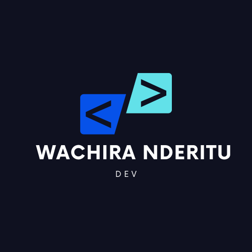

<a name="readme-top">Portfolio-Setup-and-Mobile-First</a>

    
   

  <h3><b>READMe File</b></h3>

!-- TABLE OF CONTENTS -->

# 📗 Table of Contents

- [📖 About the Project](#about-project)
  - [🛠 Built With](#built-with)
    - [Tech Stack](#tech-stack)
    - [Key Features](#key-features)
- [💻 Getting Started](#getting-started)
  - [Setup](#setup)
  - [usage](#usage)
- [👥 Authors](#authors)
- [🔭 Future Features](#future-features)
- [⭐️ Show your support](#support)
- [🙏 Acknowledgements](#acknowledgements)

<a name="about-project">portfolio-setup-and-mobile-first</a>

This is my first milestone in the process of coming up with a responsive and appealing software development portfolio. Its my second project in week one of Microverse journey of becoming a software developer.

This project marks the begining of my reposnive professional site. It is made purely of HTML and CSS codes 

## 🛠 Built With 
HTML 
CSS

<!-- Features -->

### Key Features 

The toolbar or header section which will have the logo section of the repository 
The headline section of the repository 

(<a href="#readme-top">back to top</a>)

<!-- GETTING STARTED -->

## 💻 Getting Started 

run the vscode on livesite to view the two sections

### Prerequisites

In order to run this project you need:
GIT
VScode
browser 

### Setup

Clone this repository to your desired folder:
 https://github.com/wachirasenior0/portfolio-setup-and-mobile-first.git

### Usage

To run the project, execute the following command:

git-clone

<!-- AUTHORS -->

## 👥 Authors 

👤 **wachirasenior0**

- GitHub: [@wachirasenior0](https://github.com/githubhandle)
- Twitter: [@wachirasenior0](https://twitter.com/twitterhandle)
- LinkedIn: [wachirasenior0](https://linkedin.com/in/linkedinhandle)

(<a href="#readme-top">back to top</a>)

<!-- FUTURE FEATURES -->

## 🔭 Future Features 

- Mobile verision
- contact form from pair programing session 
- Desktop version
- Application deploy 
- Accesibility evaluation 
- Mobile Menu
- Details Modal
- contact form 

(<a href="#readme-top">back to top</a>)

<!-- SUPPORT -->

## ⭐️ Show your support 

leave us a five star ⭐️⭐️⭐️⭐️⭐️

(<a href="#readme-top">back to top</a>)

<!-- ACKNOWLEDGEMENTS -->

## 🙏 Acknowledgments 

I would like to thank Microverse for making my dream come true. Continue supporting my work

(<a href="#readme-top">back to top</a>)

